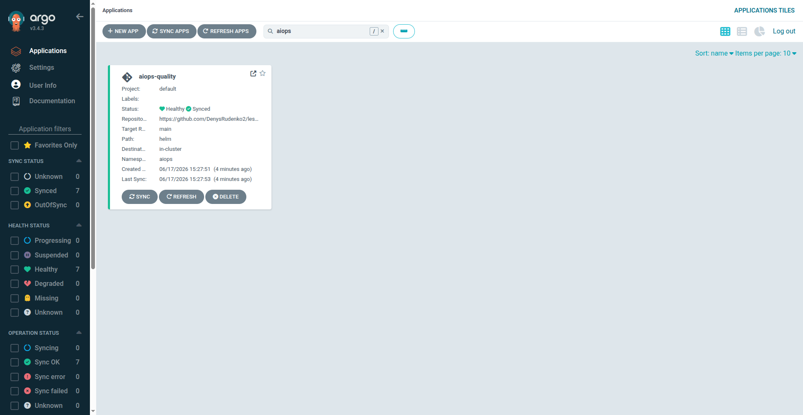
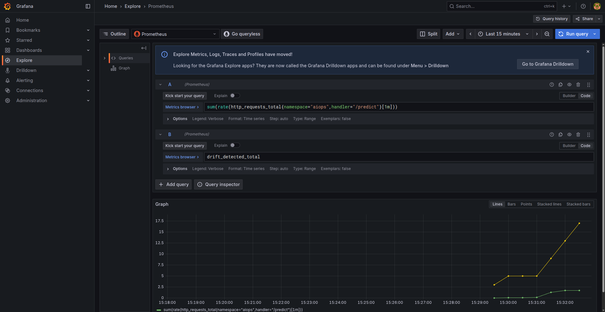
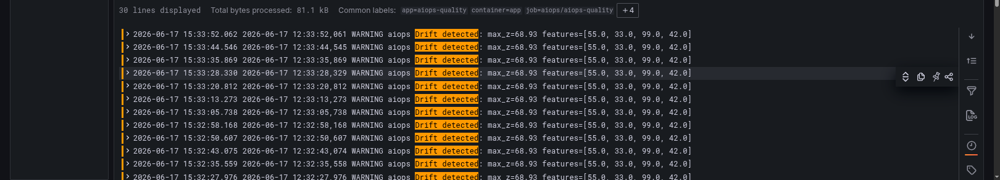

# Final Project — AIOps Quality (inference + drift + GitOps + observability)

Фінальний проєкт MLOps-курсу: ML inference-сервіс на **FastAPI** з вбудованим
**drift-детектором**, задеплоєний у Kubernetes (EKS) через **Helm + ArgoCD**,
з **Prometheus/Grafana** (метрики), **Loki/Promtail** (логи) і **GitLab CI**
retrain-пайплайном.

## Архітектура

```
                         ┌──────────────── EKS (mlops-eks) ────────────────┐
client ── /predict ──►   │  FastAPI (ns aiops)                              │
                         │   ├─ predict()         → відповідь + ймовірність │
                         │   ├─ drift_detector()  → лог "Drift detected"    │
                         │   └─ /metrics          → Prometheus              │
ArgoCD (GitOps) ────────►│  Helm-чарт цього репо (auto-sync, self-heal)     │
Prometheus ── scrape ───►│  ServiceMonitor → метрики (req/s, latency, drift)│
Promtail ── stdout ─────►│  Loki → Grafana Explore (логи запитів/дрейфу)    │
                         └──────────────────────────────────────────────────┘
GitLab CI (drift/manual) ─► retrain → новий образ ghcr → bump Helm tag → ArgoCD redeploy
```

## Скриншоти (реальні, з кластера)

### ArgoCD — застосунок `aiops-quality` (Synced / Healthy)
GitOps-деплой Helm-чарту з цього репо (path `helm`, ns `aiops`).



### Grafana — метрики сервісу
`http_requests_total` (req/s до `/predict`) та `drift_detected_total` — реальні дані,
зібрані Prometheus через ServiceMonitor.



### Grafana → Loki — логи дрейфу
Логи сервісу (Promtail → Loki), відфільтровані `{namespace="aiops"} |= "Drift detected"`.



## Структура

```
aiops-quality-project/
├── app/main.py            # FastAPI: predict(), drift_detector(), /metrics, логування
├── model/train.py         # тренування + статистика фіч (еталон для дрейфу) → model.pkl
├── Dockerfile             # образ сервісу (модель запікається при білді)
├── helm/                  # Chart.yaml, values.yaml, templates (Deployment/Service/ServiceMonitor)
├── argocd/
│   ├── application.yaml    # GitOps-деплой сервісу (auto-sync + self-heal)
│   └── loki.yaml           # Loki + Promtail
├── prometheus/additionalScrapeConfigs.yaml
├── grafana/dashboards.json # дешборд: req/s, latency p95, прогнози, drift
├── .gitlab-ci.yml          # retrain-model → build → redeploy
└── README.md
```

## Інфраструктура

Будує на кластері з попередніх тем: **EKS** + **ArgoCD** (ns `infra-tools`) +
**kube-prometheus-stack** (Prometheus + Grafana, ns `monitoring`).
Образ сервісу — `ghcr.io/denysrudenko2/aiops-quality` (приватний; кластер тягне
через imagePullSecret `ghcr-pull`).

## Запуск

### 1. Образ (вже в ghcr; перебілд за потреби)
```bash
docker build -t ghcr.io/denysrudenko2/aiops-quality:latest .
docker push ghcr.io/denysrudenko2/aiops-quality:latest
```

### 2. imagePullSecret (приватний ghcr-образ)
```bash
kubectl create namespace aiops
kubectl create secret docker-registry ghcr-pull \
  --docker-server=ghcr.io --docker-username=<github-user> --docker-password=<ghcr-token> \
  -n aiops
```

### 3. Деплой через ArgoCD
```bash
kubectl apply -f argocd/application.yaml   # FastAPI-сервіс (Helm)
kubectl apply -f argocd/loki.yaml          # Loki + Promtail
kubectl get applications -n infra-tools    # aiops-quality: Synced/Healthy
kubectl get pods -n aiops
```

## Перевірка

### Запит до API
```bash
kubectl port-forward -n aiops svc/aiops-quality 8000:8000 &
# нормальний приклад
curl -X POST localhost:8000/predict -H 'Content-Type: application/json' \
     -d '{"features":[5.1,3.5,1.4,0.2]}'
# → {"prediction":0,"class_name":"setosa","probability":0.97,"drift_detected":false}
```

### Спрацювання drift-детектора (аномальні значення)
```bash
curl -X POST localhost:8000/predict -H 'Content-Type: application/json' \
     -d '{"features":[50,30,99,40]}'
# → "drift_detected":true
kubectl logs -n aiops deploy/aiops-quality | grep "Drift detected"
```

### Логування (Loki)
Кожен запит/відповідь логуються в stdout → Promtail → Loki. У Grafana → **Explore**
→ Loki: `{namespace="aiops"}` (і `|= "Drift detected"` для дрейфу).

### Метрики (Grafana)
```bash
kubectl port-forward -n monitoring svc/monitoring-grafana 3000:80 &
# admin / prom-operator → імпортувати grafana/dashboards.json
```
Метрики: `http_requests_total`, `predict_latency_seconds`, `model_predictions_total`,
`drift_detected_total`.

### Retrain-пайплайн
`.gitlab-ci.yml` job `retrain-model` (ручний/scheduled/trigger) → `python model/train.py`
→ build+push нового образу → bump `helm/values.yaml` tag → push → **ArgoCD auto-sync**
підхоплює новий образ (redeploy). У сервісі при `Drift detected` можна викликати
GitLab trigger (webhook) для авто-retrain.

## Як оновити модель
1. Змінити `model/train.py` (дані/алгоритм/параметри).
2. Запустити `retrain-model` (або локально build+push нового тегу).
3. ArgoCD redeploy за оновленим `helm/values.yaml` tag.
